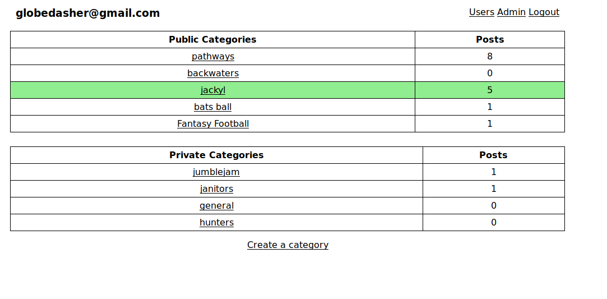
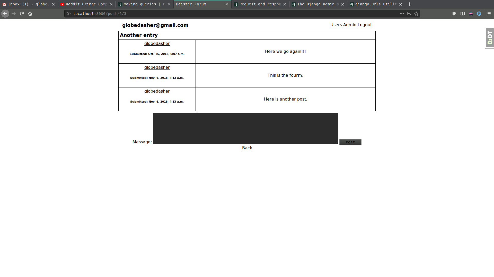
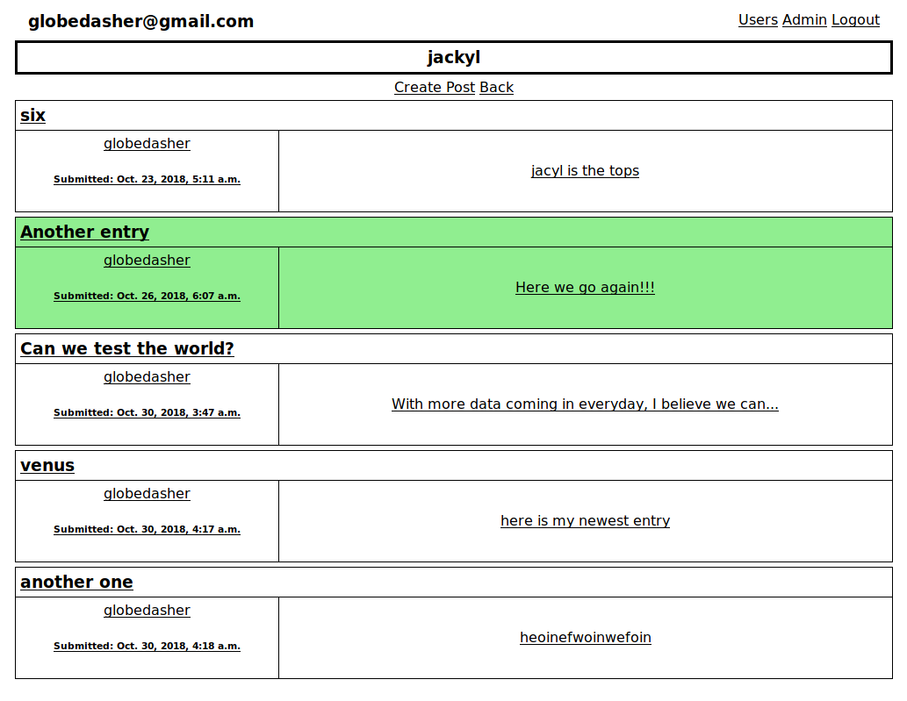

To run the application, use the following commands:

# For local mode.
python manage.py runserver --settings=heister_forum.settings_local

# For production mode.
python manage.py runserver

This project is a simple forum for whatever use you may want. I am building it
as an example to present to prospective employers. 

This is the main index view of the applicaiton. Public categories are shown
without logging in while public and private categories are shown when
authenticated.

This is the main list of existing posts in a category.

This is the view of an individual post with the choice to post a reply.

